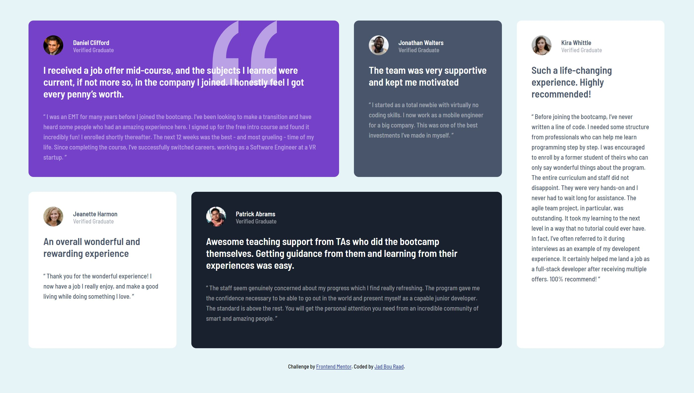

# Testimonial grid section

This is a solution to the [Testimonials grid section challenge on Frontend Mentor](https://www.frontendmentor.io/challenges/testimonials-grid-section-Nnw6J7Un7).

The project aim is the practice the use of a layout grid, with a responsive design to several screen widths.

## Technologies Used

-HTML structure

- Basic CSS properties

  - universal selector
  - background-color
  - border radius
  - absolute positioning
  - grid layout diplay (with 4 columns and 2 rows equally spaced columns)
  - rows and columns positioning
  - flex display
  - media queries (responsive design for 3 main screen sizes):
    - max width: 1400px+
    - max width: 1200px
    - max width: 1008px
    - max width: 880px

- Google Fonts link

## Links

- **Solution URL:** https://github.com/J-B-R-93/Testimonial-grid-section

- **Live Site URL:** https://j-b-r-93.github.io/Testimonial-grid-section/

## Screenshot

##
